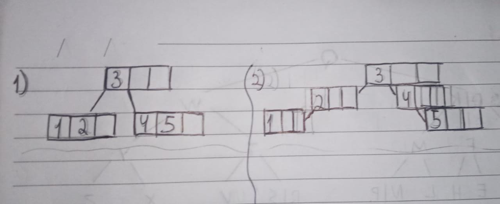
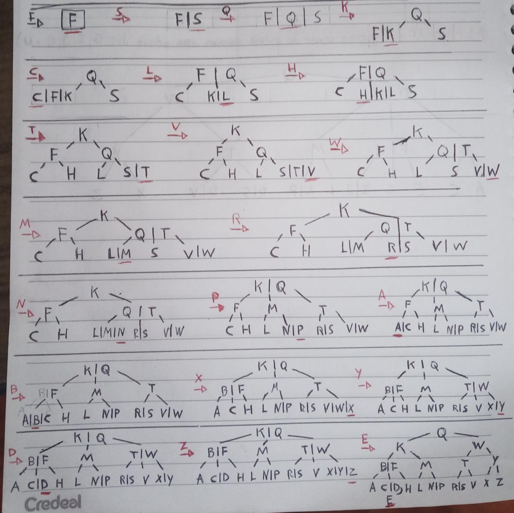
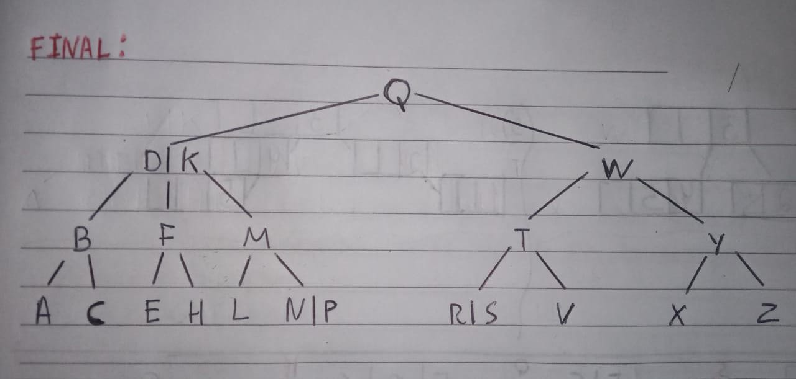
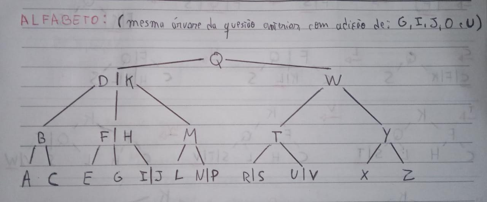

# Lista de exercícios - Árvore B

## Aluno: Dahan Schuster | RA: 2301792

---

## 1º

Uma árvore com grau mínimo `t = 1` teria no máximo `2t - 1 = 1` chaves em cada
nó, e um máximo de `2t = 2` filhos por nó, o que seria equivalente a uma árvore
AVL comum. Um dos grandes trunfos da árvore B é ter mais de uma chave em cada nó
(com exceção da raiz) e permitir mais de dois filhos por nó.

Outro problema é que o mínimo de chaves em cada nó seria `t - 1 = 0`, o que não
faz sentido já que uma árvore *deve* ter chaves em cada nó.

## 2º

Todo nó diferente da raiz deve ter pelo menos `t − 1` chaves. Seguindo essa regra,
a árvore indicada pode ter um grau `t = 2`, uma vez que nenhum de seus nós possui
menos que duas chaves, nem mais que três, respeitando também a regra: todo nó
pode ter no máximo `2t − 1 = 3` chaves. O número de filhos por nós também é
respeitado, sendo `2t = 4` o máximo de filhos visto na árvore.

A árvore também poderia ter grau `t = 3`, pois seu limite inferior de chaves por
nó, `t - 1 = 2`, não seria violado, assim como o limite máximo `2t - 1 = 5` e o
limite de filhos por nó `2t = 6`.

Para valores de `t > 3`, no entando, a árvore se torna inválida, uma vez que há
nós com apenas 2 chaves, o que seria menos que o mínimo de chaves: `t - 1 >= 3`

Conclusão: a árvore é válida para `t = 2` e `t = 3`.

## 3º

## 4º

## 5º

A árvore que representa o alfabeto pode ser obtida ao adicionar as chaves
"G", "I", "J", "O" E "U" à árvore da questão anterior:

